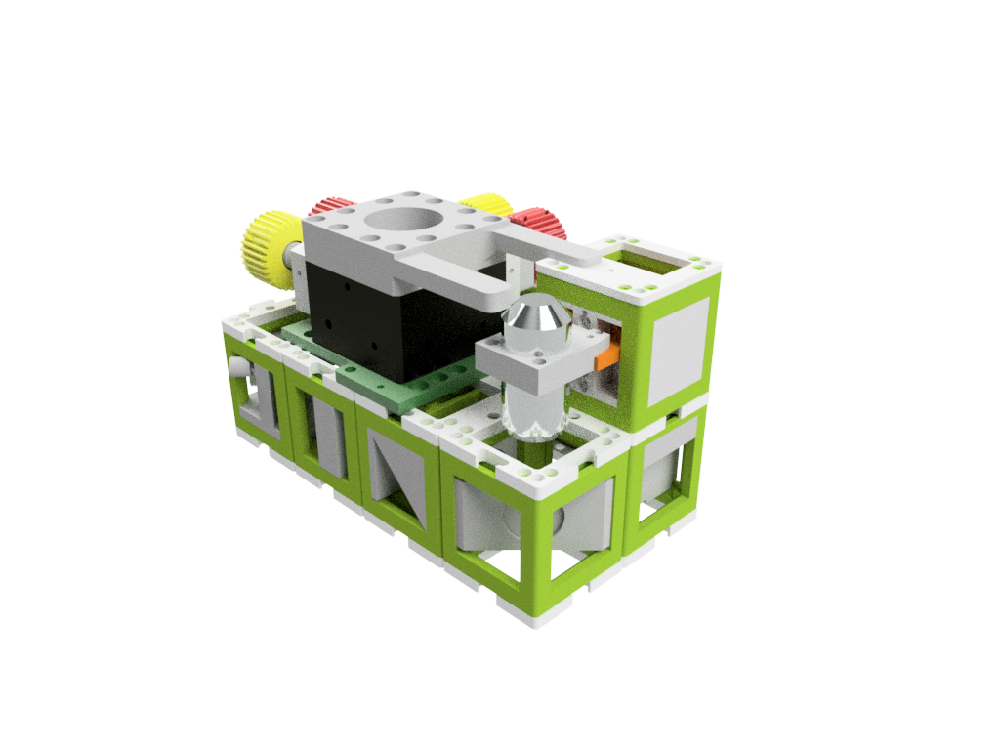
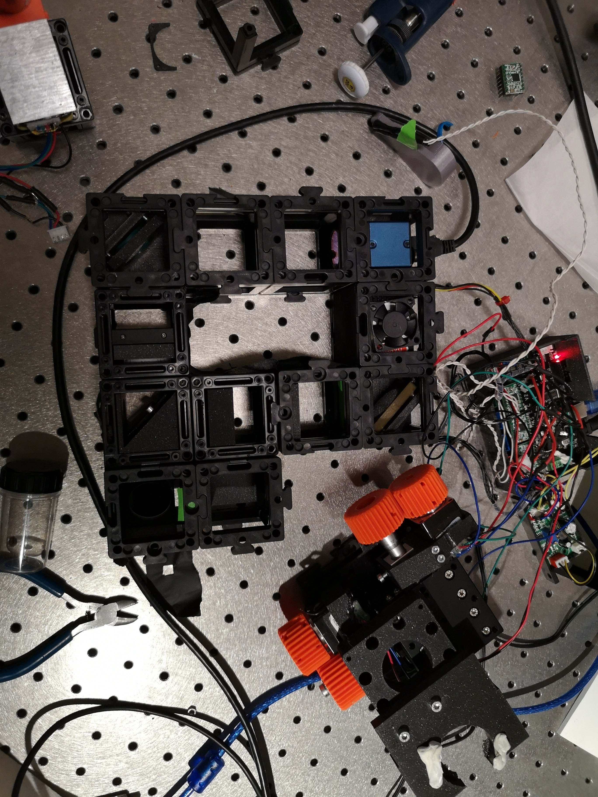
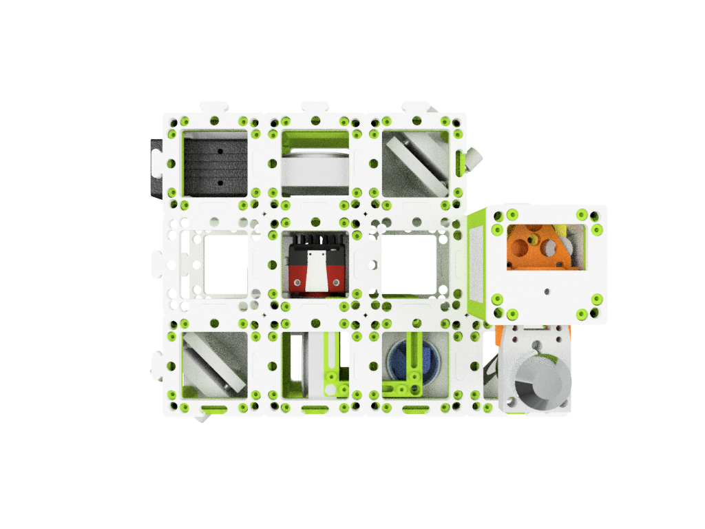
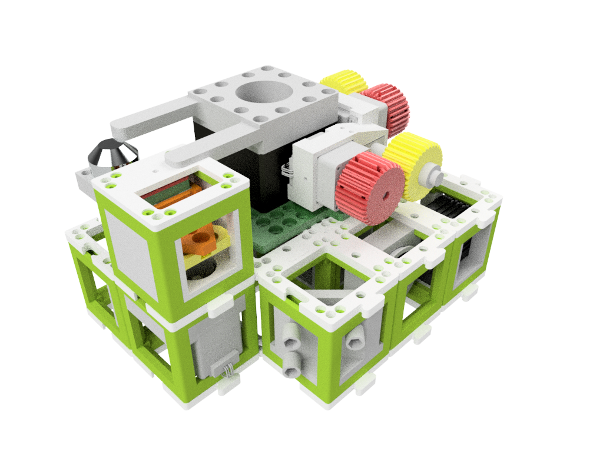
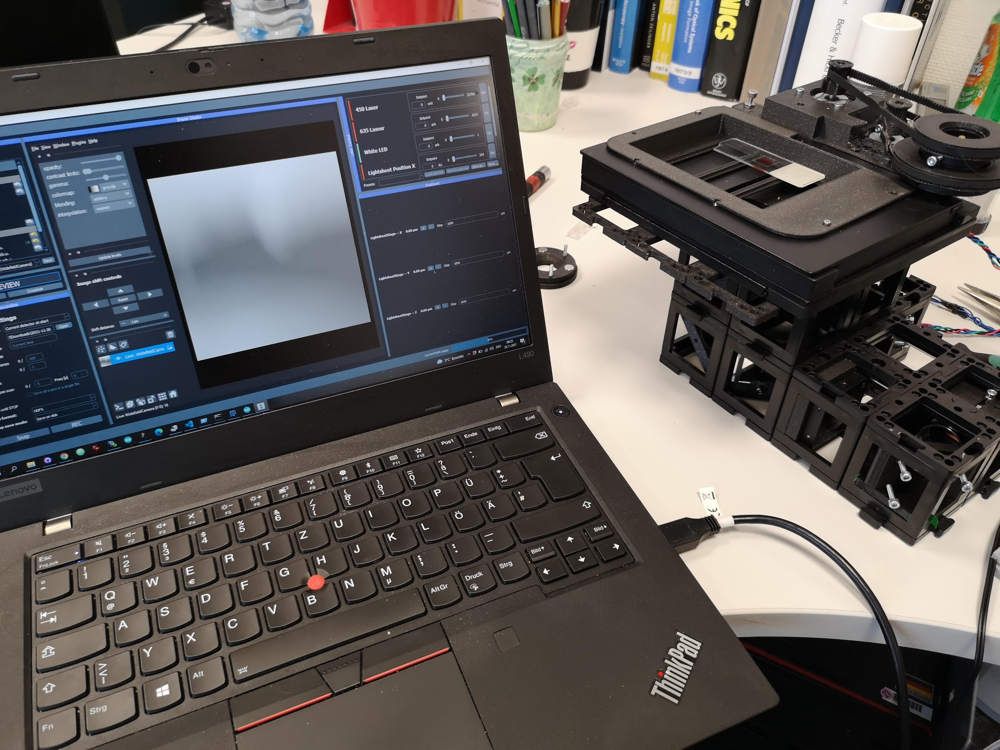
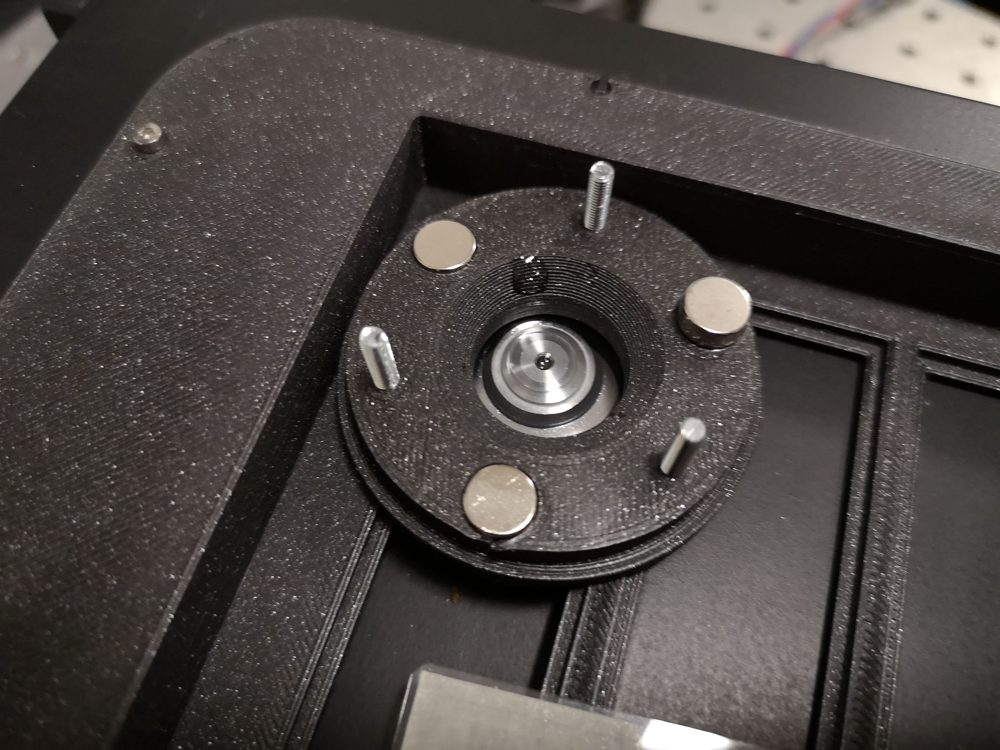

# openUC2 Fluorescence Microscope (infinity)
---

This is the repository for the laser-based fluorescence microscope with infinity optics. It is capable to acquire Time-Lapse videos from living cells inside an incubator.

The current version of the Z-stage is inspired by the flexure-bearing Z-stage from Richard Bowman's openflexure microscope design. Their open-source project can be found [here](https://openflexure.org). We also emphasize to use the [delta stage](https://openflexure.org/projects/deltastage/) where [UC2 provides an adapter](https://github.com/openUC2/UC2-GIT/tree/master/CAD/ASSEMBLY_CUBE_Openflexure_Deltastage) for our system.

The setup looks as follows:

We use a high power entertainment laser to excite a specific fluorophore, where the emission signal is either filtered by a proper dichroic mirror cube (dichroic+filter) or a low-cost version of a simple 50/50 beamsplitter and an emission filter. The setup uses infinity optics and can either be used with a bare chip or a combination of cellphone camera (with lens) and an eyepiece to achieve proper imaging.

It is a very early developer version. Please feel free to contribute to the documentation and device development.

*Note:* The pictures on this site do not show the latest version of the Z-stage. Follow the respective assembly guidelines.

***Features:***

* X/Y/Z/t Acquisitions possible
* Fluorescent imaging
* Quantitative Phase Imaging
* Modularized design
* Low-cost acquisition
* Based on off-the-shelf components
* Open-Source
* infinity corrected optics
* use of low-cost CMOS sensors possible

# Software
🢂 Find the software for this setup in our dedicated [UC2-Software-GIT](https://github.com/bionanoimaging/UC2-Software-GIT)

# Hardware

Below we describe how the device can be build and assembled in order to replicate the whole system as shown in the rendering above. One needs additional parts that can be found in the core [openUC2 repository](https://github.com/bionanoimaging/UC2-GIT).

### Parts for this setup

| Amount | Type  | Properties | Price | Source                                            |
|----|----|----|----|----|
| 1 | Camera | Daheng Imaging MER2-230-168U3M | 500 € | Daheng Imaging [Link](https://www.machinevisionkamera.de/USB3-Bildverarbeitungskamera-2.3MP-Monochrome-Sony-IMX174-MER2-230-168U3M)|
| 1  | Camera | USB ALVIUM 1800 U -158 | 333 € | Allied Vision [Edmund Optics](https://www.edmundoptics.de/p/allied-vision-alvium-1800-u-158m-129-16mp-s-mount-usb-31-monochrome-camera/42981/) |
| 1 | Laser | 1× Laser Module, 635/637nm entertainment laser (laserlands.net, #3450, Dot Laser Module, 300mW, 50 Euro, China)  | 60 €| [Laserlands.net](https://www.laserlands.net/638nm-laser-500mw-laser-module-red-light-laser.html)|
| 1 | Emission Filter (we used on old Chroma, QE690/55!) | Thorlabs FEL0650 | 78 € | [Thorlabs](https://www.thorlabs.com/thorproduct.cfm?partnumber=FEL0650) |
| 1 | Dichroic Mirror | DMLP650 | 250 € | [Thorlabs](https://www.thorlabs.com/thorproduct.cfm?partnumber=DMLP650) |
| 1 | Shortpass Filter (cleanup)  | FES0650 | 78 € | [Thorlabs](https://www.thorlabs.com/thorproduct.cfm?partnumber=FES0650) |
| 2 | Mirrors 1 inch                         | Silver, protected mirror | 50 €   | [Thorlabs](https://www.thorlabs.com/thorproduct.cfm?partnumber=PF10-03-P01) |
| 1 | Tube lense according to objective lens (imaging-side) | 80 mm for Allied Vision, 150 for Daheng Imaging, Achromat | 96 € | [Thoralbs](https://www.thorlabs.de/thorproduct.cfm?partnumber=AC254-080-A-ML)/[Thoralbs](https://www.thorlabs.de/thorproduct.cfm?partnumber=AC254-150-A-ML) |
| 1 | Tube Lens (illumination-side) | Achromat, f 156,4mm / ∅40,0mm  or  f 150 mm / ∅25,4mm | 5,9 € / 96 €   | [PGI-Versand](https://astro-didaktik.de/achromat-2-linser-o-40-mm-f-156-4-mm.html)/[Thoralbs](https://www.thorlabs.de/thorproduct.cfm?partnumber=AC254-150-A-ML) |
| 1 | M3 Screws, DIN ISO 912, various (buy a set) | | ? | Würth |
| 1 | Microscope Objective lens | 1x Objective lens, No Name, 100x, NA1.25, 50 Euro, China                                               | 100 € | [Aliexpress](https://de.aliexpress.com/item/4000200609554.html) |
| 1 | Beam Splitter Dichroic (Discontinued?) | Comar optics Dichro 740 IY als 45° | 40 € | Comar                                             |
| 1 | Filter Emission (Discontinued?) | Emissionsfilter 655 IY als 0° | 40 € | Comar |
|   200  | Magnets  | 5mm Ball Magnets, NEoxym  | 0,31 | [Magnetmax](https://www.magnetmax.de/Neodym-Kugelmagnete/Magnetkugel-Kugelmagnet-O-5-0-mm-Neodym-vernickelt-N40-haelt-400-g::158.html?XTCsid=8a83b5bb1601ec808d634714960a4e25)         ||    4   | Mirrors 1 inch                            | Thoralbs                          | ~50    | [Thorlabs](https://www.thorlabs.com/thorproduct.cfm?partnumber=PF10-03-P01)                                                                                         |  1x500 | Screws M3x12 | | ?  | [Würth](https://eshop.wuerth.de/Zylinderschraube-mit-Innensechskant-SHR-ZYL-ISO4762-88-IS25-A2K-M3X12/00843%20%2012.sku/de/DE/EUR/)

Find the complete [Bill-of-Materials here](UC2_Microscope_BillOfMaterial_STORM.xlsx)

## Modules

|  Name | Properties  |  Price | Link  | # |
|---|---|---|---|---|
|  Baseplate puzzle| - | 5€  | [Base-plate](https://github.com/openUC2/UC2-GIT/tree/master/CAD/ASSEMBLY_Baseplate/)  | ~20|
|  Module: Z-Stage | - | ?? €  | [Z-Stage](https://github.com/openUC2/UC2-GIT/tree/master/CAD/ASSEMBLY_CUBE_Z-STAGE_NEMA_MGN)  | 1|
| (Alternative) [Delta stage](https://openflexure.org/projects/deltastage/)  | Openflexure | ?? €  | [Deltastage](https://github.com/openUC2/UC2-GIT/tree/master/CAD/ASSEMBLY_CUBE_Openflexure_Deltastage)  | 1|
|  Module: Kinematic Mirror 45°  (THORLABS!) | - | 5€  | [Kinematic Mirror 45](https://github.com/openUC2/UC2-GIT/tree/master/CAD/ASSEMBLY_CUBE_Mirror_Kinematic_45)  | 2 |
|  Module: Alvium CMOS Camera  | Low-Cost Camera | 5€  | [Alvium Camera](https://github.com/openUC2/UC2-GIT/tree/master/CAD/ASSEMBLY_CUBE_AlliedVision_Alvium)  | 1|
| Alternative (better) Daheng Imaging IMX174 | SMLM Camera | 5€  | [Alvium Camera](https://github.com/openUC2/UC2-GIT/tree/master/CAD/ASSEMBLY_CUBE_AlliedVision_Alvium)  | 1 |
|  Module: Beamsplitter (dichroic)  | - | ??€  | [Dichroic Beam splitter](https://github.com/openUC2/UC2-GIT/tree/master/CAD/ASSEMBLY_CUBE_Dichroic_Beamsplitter)  | 1|
|  Module: Thorlabs + Lens (160mm, 80mm) | - | 5€  | [Thorlabs Insert](https://github.com/openUC2/UC2-GIT/tree/master/CAD/ASSEMBLY_CUBE_Thorlabs)  | 2 |
|  Module: Laser (Block) | - | 5€  | Just mount the laser on the insert using screws.   | 2 |
|  Module: 45° Mirror  (Thorlabs) | - | 5€  | [Mirror](https://github.com/openUC2/UC2-GIT/tree/master/CAD/ASSEMBLY_CUBE_Mirror_45)  | 2 |

### Variants

We use various different XY Stages:

[**1. Micrometer XY-stage**](https://github.com/openUC2/UC2-MicronStage)

[**2. Aliexpress Microscop XY-stage**](https://github.com/openUC2/UC2-Motorized-XY-Table)

**3. Openflexure Stage**

### Electronics
🢂 Find more in the [Electronics section](https://github.com/openUC2/UC2-GIT/tree/master/ELECTRONICS)

## Setup variants

**Assembled Setups with a Jetson-driven mono camera:**

For more infos about the camera look [here](https://github.com/openUC2/UC2-GIT/tree/master/CAD/ASSEMBLY_CUBE_AlliedVision_Alvium)

## Setup

**Side View:**

**Top View:**

**Backside View:**

**Find a little [Tutorial on how to make it work here](Tutorial.md)**

## Showcase
This is a set of ATTO 647 labelled *e.colis* provided by O. Helle from UiO imaged with a 100x, 1.25, a cellphone (Huawei P20 Pro, monochromatic camera, Freedcam) and a 635/637 nm exciation.

This is acquired with the Allied Vision Alvium 1500-158 and the new UC2 Nvidia Jetson Nano GUI. HeLa labelled with Alexa Fluor 647 Phal.

***Brightfield***

***Fluorescence***

***Overlay***



***Optical Setup***

***ImSwitch Control Software***

***SMLM Sample Holder***

## Get Involved

This project is open-source so that anyone can get involved. You don't even have to learn CAD designing or programming. Find ways you can contribute in  [CONTRIBUTING](https://github.com/openUC2/UC2-GIT/blob/master/CONTRIBUTING.md)

## License and Collaboration

This project is open-source and is released under the CERN open hardware license. Our aim is to make the kits commercially available.
We encourage everyone who is using our Toolbox to share their results and ideas, so that the Toolbox keeps improving. It should serve as a easy-to-use and easy-to-access general purpose building block solution for the area of STEAM education. All the design files are generally for free, but we would like to hear from you how is it going.

You're free to fork the project and enhance it. If you have any suggestions to improve it or add any additional functions make a pull-request or file an issue.

Please find the type of licenses [here](https://github.com/openUC2/UC2-GIT/blob/master/License.md)

REMARK: All files have been designed using Autodesk Inventor 2019 (EDUCATION)

## Collaborating
If you find this project useful, please like this repository, follow us on Twitter and cite the webpage! :-)
